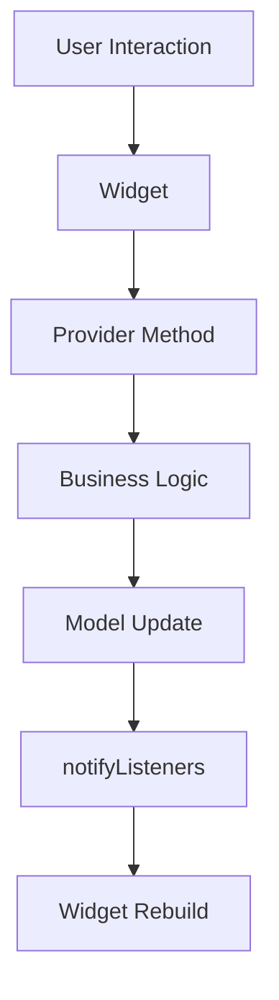

# 🛠️ 开发指南

本文档为宠物消消乐·炫彩版项目的开发人员提供详细的技术指导和最佳实践。

## 📋 目录

- [开发环境配置](#开发环境配置)
- [项目架构详解](#项目架构详解)
- [核心模块开发](#核心模块开发)
- [UI/UX 开发规范](#ui-ux-开发规范)
- [性能优化指南](#性能优化指南)
- [测试策略](#测试策略)
- [调试技巧](#调试技巧)
- [常见问题解决](#常见问题解决)

---

## 🚀 开发环境配置

### 必需软件

#### 1. Flutter SDK 安装

```bash
# Windows - 使用 Chocolatey
choco install flutter

# macOS - 使用 Homebrew
brew install --cask flutter

# 验证安装
flutter doctor
```

#### 2. 开发工具配置

**VS Code 配置**
```json
// .vscode/settings.json
{
  "dart.flutterSdkPath": "/path/to/flutter",
  "dart.debugExternal": true,
  "dart.debugSdkLibraries": false,
  "dart.previewLsp": true,
  "dart.lineLength": 80,
  "editor.rulers": [80],
  "editor.formatOnSave": true
}
```

**Android Studio 配置**
- 安装 Flutter 和 Dart 插件
- 配置 Android SDK 路径
- 设置 JDK 版本（推荐 JDK 11+）

#### 3. 模拟器设置

**Android 模拟器**
```bash
# 创建 AVD
flutter emulators --create --name pixel_5

# 启动模拟器
flutter emulators --launch pixel_5
```

**iOS 模拟器（仅 macOS）**
```bash
# 启动 iOS 模拟器
open -a Simulator

# 列出可用设备
xcrun simctl list devices
```

### 项目初始化

```bash
# 克隆项目
git clone <repository-url>
cd pet-match-game

# 安装依赖
flutter pub get

# 生成代码（如果有）
flutter packages pub run build_runner build

# 运行项目
flutter run
```

---

## 🏗️ 项目架构详解

### 整体架构

项目采用 **MVVM + Provider** 架构模式：

```
┌─────────────────┐    ┌─────────────────┐    ┌─────────────────┐
│      View       │◄──►│   ViewModel     │◄──►│     Model       │
│   (Widgets)     │    │  (Providers)    │    │   (Data)        │
└─────────────────┘    └─────────────────┘    └─────────────────┘
```

### 目录结构说明

```
lib/
├── main.dart                    # 应用入口点
├── models/                      # 数据模型层
│   ├── pet_tile.dart           # 宠物方块数据模型
│   ├── pet_type.dart           # 宠物类型枚举
│   ├── game_state.dart         # 游戏状态模型
│   └── player_progress.dart    # 玩家进度模型
├── providers/                   # 状态管理层
│   ├── game_provider.dart      # 游戏逻辑控制器
│   ├── audio_provider.dart     # 音频控制器
│   ├── settings_provider.dart  # 设置控制器
│   └── progress_provider.dart  # 进度控制器
├── widgets/                     # UI组件层
│   ├── common/                 # 通用组件
│   │   ├── animated_button.dart
│   │   ├── custom_dialog.dart
│   │   └── loading_spinner.dart
│   ├── game/                   # 游戏相关组件
│   │   ├── game_grid.dart
│   │   ├── pet_tile_widget.dart
│   │   └── game_info_panel.dart
│   └── ui/                     # 界面组件
│       ├── game_over_dialog.dart
│       ├── settings_screen.dart
│       └── home_screen.dart
├── screens/                     # 页面层
│   ├── game_screen.dart
│   ├── home_screen.dart
│   ├── settings_screen.dart
│   └── about_screen.dart
├── services/                    # 服务层
│   ├── audio_service.dart
│   ├── storage_service.dart
│   ├── analytics_service.dart
│   └── notification_service.dart
├── utils/                       # 工具类
│   ├── constants.dart
│   ├── extensions.dart
│   ├── helpers.dart
│   └── validators.dart
└── themes/                      # 主题样式
    ├── app_theme.dart
    ├── colors.dart
    └── text_styles.dart
```

### 数据流



---

## 💾 核心模块开发

### 游戏逻辑模块

#### GameProvider 核心方法

```dart
class GameProvider extends ChangeNotifier {
  // 关键方法实现示例
  
  /// 处理方块点击事件
  void onTileTap(int row, int col) {
    if (_isAnimating || _isGameOver) return;
    
    final tile = _grid[row][col];
    if (tile == null) return;
    
    if (_selectedTiles.isEmpty) {
      _selectTile(tile);
    } else if (_selectedTiles.length == 1) {
      _handleSecondTileSelection(tile);
    }
    
    notifyListeners();
  }
  
  /// 检测匹配算法
  bool _hasMatchAt(int row, int col) {
    // 边界检查
    if (!_isValidPosition(row, col)) return false;
    
    final petType = _grid[row][col]?.petType;
    if (petType == null) return false;
    
    // 水平匹配检测
    final horizontalCount = _countHorizontalMatches(row, col, petType);
    if (horizontalCount >= 3) return true;
    
    // 垂直匹配检测
    final verticalCount = _countVerticalMatches(row, col, petType);
    return verticalCount >= 3;
  }
  
  /// 异步匹配处理
  Future<void> _processMatches() async {
    if (_matchProcessingDepth >= maxMatchDepth) {
      debugPrint('达到最大匹配深度，停止递归');
      return;
    }
    
    _matchProcessingDepth++;
    
    try {
      final matchedTiles = _findAllMatches();
      
      if (matchedTiles.isNotEmpty) {
        await _animateMatchedTiles(matchedTiles);
        _calculateScore(matchedTiles);
        await _dropTilesWithAnimation();
        await _fillEmptySpaces();
        
        // 检查连锁反应
        if (_checkForMatches()) {
          await _processMatches();
        }
      }
    } finally {
      _matchProcessingDepth--;
    }
  }
}
```

#### 性能优化要点

```dart
// 1. 使用对象池减少 GC 压力
class TilePool {
  static final Queue<PetTile> _pool = Queue<PetTile>();
  
  static PetTile acquire(int row, int col, PetType type) {
    if (_pool.isNotEmpty) {
      final tile = _pool.removeFirst();
      return tile.copyWith(row: row, col: col, petType: type);
    }
    return PetTile(row: row, col: col, petType: type);
  }
  
  static void release(PetTile tile) {
    tile.resetStates();
    _pool.add(tile);
  }
}

// 2. 批量状态更新
class BatchNotifier extends ChangeNotifier {
  bool _isBatching = false;
  bool _needsNotify = false;
  
  void startBatch() {
    _isBatching = true;
  }
  
  void endBatch() {
    _isBatching = false;
    if (_needsNotify) {
      notifyListeners();
      _needsNotify = false;
    }
  }
  
  @override
  void notifyListeners() {
    if (_isBatching) {
      _needsNotify = true;
    } else {
      super.notifyListeners();
    }
  }
}
```

### 动画系统

#### 高性能动画组件

```dart
class OptimizedAnimatedWidget extends StatefulWidget {
  final Widget child;
  final Duration duration;
  final Curve curve;
  
  const OptimizedAnimatedWidget({
    super.key,
    required this.child,
    this.duration = const Duration(milliseconds: 300),
    this.curve = Curves.easeInOut,
  });
  
  @override
  State<OptimizedAnimatedWidget> createState() => _OptimizedAnimatedWidgetState();
}

class _OptimizedAnimatedWidgetState extends State<OptimizedAnimatedWidget>
    with SingleTickerProviderStateMixin {
  late AnimationController _controller;
  late Animation<double> _animation;
  
  @override
  void initState() {
    super.initState();
    _controller = AnimationController(
      duration: widget.duration,
      vsync: this,
    );
    
    _animation = CurvedAnimation(
      parent: _controller,
      curve: widget.curve,
    );
  }
  
  @override
  Widget build(BuildContext context) {
    return AnimatedBuilder(
      animation: _animation,
      builder: (context, child) {
        return Transform.scale(
          scale: _animation.value,
          child: widget.child,
        );
      },
    );
  }
  
  @override
  void dispose() {
    _controller.dispose();
    super.dispose();
  }
}
```

---

## 🎨 UI/UX 开发规范

### 响应式设计

#### 屏幕适配策略

```dart
class ResponsiveHelper {
  static bool isTablet(BuildContext context) {
    return MediaQuery.of(context).size.shortestSide >= 600;
  }
  
  static bool isLandscape(BuildContext context) {
    return MediaQuery.of(context).orientation == Orientation.landscape;
  }
  
  static double getResponsiveWidth(BuildContext context, double factor) {
    final screenWidth = MediaQuery.of(context).size.width;
    return screenWidth * factor;
  }
}

// 使用示例
Widget _buildResponsiveGrid(BuildContext context) {
  final isTablet = ResponsiveHelper.isTablet(context);
  final gridPadding = isTablet ? 32.0 : 16.0;
  final tileSpacing = isTablet ? 8.0 : 4.0;
  
  return Padding(
    padding: EdgeInsets.all(gridPadding),
    child: GridView.builder(
      gridDelegate: SliverGridDelegateWithFixedCrossAxisCount(
        crossAxisCount: GameProvider.gridSize,
        crossAxisSpacing: tileSpacing,
        mainAxisSpacing: tileSpacing,
      ),
      itemBuilder: (context, index) => _buildTile(index),
    ),
  );
}
```

#### 主题系统

```dart
class AppTheme {
  static const Color primaryColor = Color(0xFFFF6B9D);
  static const Color secondaryColor = Color(0xFF4ECDC4);
  
  static ThemeData get lightTheme => ThemeData(
    useMaterial3: true,
    colorScheme: ColorScheme.fromSeed(
      seedColor: primaryColor,
      brightness: Brightness.light,
    ),
    textTheme: _textTheme,
    elevatedButtonTheme: _elevatedButtonTheme,
  );
  
  static const TextTheme _textTheme = TextTheme(
    headlineLarge: TextStyle(
      fontSize: 32,
      fontWeight: FontWeight.bold,
      color: Color(0xFF2D3436),
    ),
    bodyLarge: TextStyle(
      fontSize: 16,
      color: Color(0xFF636E72),
    ),
  );
  
  static ElevatedButtonThemeData get _elevatedButtonTheme =>
      ElevatedButtonThemeData(
        style: ElevatedButton.styleFrom(
          shape: RoundedRectangleBorder(
            borderRadius: BorderRadius.circular(12),
          ),
          padding: const EdgeInsets.symmetric(
            horizontal: 24,
            vertical: 12,
          ),
        ),
      );
}
```

### 动画设计原则

#### 1. 时序控制

```dart
class AnimationTimings {
  static const Duration short = Duration(milliseconds: 150);
  static const Duration medium = Duration(milliseconds: 300);
  static const Duration long = Duration(milliseconds: 500);
  
  // 游戏特定动画时长
  static const Duration tileSwap = Duration(milliseconds: 400);
  static const Duration tileMatch = Duration(milliseconds: 500);
  static const Duration tileFall = Duration(milliseconds: 600);
}
```

#### 2. 缓动曲线

```dart
class AnimationCurves {
  static const Curve elasticOut = Curves.elasticOut;
  static const Curve bounceOut = Curves.bounceOut;
  static const Curve easeInOut = Curves.easeInOut;
  
  // 自定义曲线
  static const Curve gameSwap = Cubic(0.25, 0.46, 0.45, 0.94);
  static const Curve gameMatch = Cubic(0.6, 0.04, 0.98, 0.335);
}
```

---

## ⚡ 性能优化指南

### 内存管理

#### 1. Widget 优化

```dart
// 好的做法：使用 const 构造函数
class GameTile extends StatelessWidget {
  const GameTile({
    super.key,
    required this.tile,
    required this.onTap,
  });
  
  final PetTile tile;
  final VoidCallback onTap;
  
  @override
  Widget build(BuildContext context) {
    return GestureDetector(
      onTap: onTap,
      child: AnimatedContainer(
        duration: AnimationTimings.short,
        decoration: BoxDecoration(
          color: tile.petType.color,
          borderRadius: BorderRadius.circular(8),
        ),
        child: Center(
          child: Text(
            tile.petType.emoji,
            style: const TextStyle(fontSize: 24), // const
          ),
        ),
      ),
    );
  }
}

// 避免的做法：不必要的 StatefulWidget
class BadGameTile extends StatefulWidget {
  // 只是显示静态内容，不需要 StatefulWidget
}
```

#### 2. 列表优化

```dart
// 使用 ListView.builder 而不是 ListView
Widget _buildGameHistory() {
  return ListView.builder(
    itemCount: gameHistory.length,
    itemExtent: 60.0, // 固定高度提升性能
    itemBuilder: (context, index) {
      final game = gameHistory[index];
      return ListTile(
        key: ValueKey(game.id), // 提供稳定的 key
        title: Text(game.title),
        subtitle: Text(game.date),
      );
    },
  );
}
```

### 渲染优化

#### 1. RepaintBoundary 使用

```dart
Widget _buildGameGrid() {
  return RepaintBoundary(
    child: GridView.builder(
      // 网格内容
    ),
  );
}

Widget _buildParticleSystem() {
  return RepaintBoundary(
    child: CustomPaint(
      painter: ParticlePainter(),
    ),
  );
}
```

#### 2. 避免不必要的重建

```dart
class GameScreen extends StatefulWidget {
  @override
  State<GameScreen> createState() => _GameScreenState();
}

class _GameScreenState extends State<GameScreen> {
  @override
  Widget build(BuildContext context) {
    return Scaffold(
      appBar: _buildAppBar(), // 提取为方法
      body: Consumer<GameProvider>(
        builder: (context, gameProvider, child) {
          return Column(
            children: [
              child!, // 不变的部分传入 child
              _buildGameInfo(gameProvider), // 变化的部分
            ],
          );
        },
        child: const GameControls(), // 静态子组件
      ),
    );
  }
  
  PreferredSizeWidget _buildAppBar() {
    return AppBar(
      title: const Text('宠物消消乐'),
    );
  }
}
```

---

## 🧪 测试策略

### 单元测试

```dart
// test/models/pet_tile_test.dart
import 'package:flutter_test/flutter_test.dart';
import 'package:pet_match_game/models/pet_tile.dart';
import 'package:pet_match_game/models/pet_type.dart';

void main() {
  group('PetTile', () {
    test('should create tile with correct properties', () {
      final tile = PetTile(
        row: 0,
        col: 1,
        petType: PetType.cat,
      );
      
      expect(tile.row, 0);
      expect(tile.col, 1);
      expect(tile.petType, PetType.cat);
      expect(tile.isSelected, false);
    });
    
    test('should copy tile with new properties', () {
      final original = PetTile(
        row: 0,
        col: 0,
        petType: PetType.cat,
      );
      
      final copy = original.copyWith(isSelected: true);
      
      expect(copy.isSelected, true);
      expect(copy.petType, PetType.cat);
      expect(original.isSelected, false); // 原对象不变
    });
  });
}
```

### Widget 测试

```dart
// test/widgets/game_tile_test.dart
import 'package:flutter/material.dart';
import 'package:flutter_test/flutter_test.dart';
import 'package:pet_match_game/widgets/game_tile.dart';
import 'package:pet_match_game/models/pet_tile.dart';
import 'package:pet_match_game/models/pet_type.dart';

void main() {
  group('GameTile Widget', () {
    testWidgets('should display pet emoji', (WidgetTester tester) async {
      final tile = PetTile(
        row: 0,
        col: 0,
        petType: PetType.cat,
      );
      
      await tester.pumpWidget(
        MaterialApp(
          home: Scaffold(
            body: GameTile(
              tile: tile,
              onTap: () {},
            ),
          ),
        ),
      );
      
      expect(find.text('🐱'), findsOneWidget);
    });
    
    testWidgets('should call onTap when tapped', (WidgetTester tester) async {
      bool wasTapped = false;
      final tile = PetTile(
        row: 0,
        col: 0,
        petType: PetType.cat,
      );
      
      await tester.pumpWidget(
        MaterialApp(
          home: Scaffold(
            body: GameTile(
              tile: tile,
              onTap: () => wasTapped = true,
            ),
          ),
        ),
      );
      
      await tester.tap(find.byType(GameTile));
      expect(wasTapped, true);
    });
  });
}
```

### 集成测试

```dart
// integration_test/game_flow_test.dart
import 'package:flutter/material.dart';
import 'package:flutter_test/flutter_test.dart';
import 'package:integration_test/integration_test.dart';
import 'package:pet_match_game/main.dart' as app;

void main() {
  IntegrationTestWidgetsFlutterBinding.ensureInitialized();
  
  group('Game Flow Integration Tests', () {
    testWidgets('complete game flow', (WidgetTester tester) async {
      app.main();
      await tester.pumpAndSettle();
      
      // 验证主页加载
      expect(find.text('🐾 宠物消消乐'), findsOneWidget);
      
      // 点击开始游戏
      await tester.tap(find.text('开始游戏'));
      await tester.pumpAndSettle();
      
      // 验证游戏界面
      expect(find.byType(GameGrid), findsOneWidget);
      
      // 执行游戏操作
      await tester.tap(find.byType(GameTile).first);
      await tester.pumpAndSettle();
      
      // 验证游戏状态更新
      expect(find.text('分数: 0'), findsOneWidget);
    });
  });
}
```

---

## 🐛 调试技巧

### Flutter Inspector

```dart
// 启用调试工具
import 'package:flutter/foundation.dart';

void main() {
  if (kDebugMode) {
    // 启用 widget 检查器
    debugPaintSizeEnabled = false; // 显示 widget 边界
    debugRepaintRainbowEnabled = false; // 重绘彩虹模式
  }
  
  runApp(const PetMatchGame());
}
```

### 性能监控

```dart
class PerformanceMonitor {
  static void trackFPS() {
    if (kDebugMode) {
      WidgetsBinding.instance.addTimingsCallback((timings) {
        for (final timing in timings) {
          final fps = 1000 / timing.totalSpan.inMilliseconds;
          if (fps < 55) {
            debugPrint('Low FPS detected: ${fps.toStringAsFixed(1)}');
          }
        }
      });
    }
  }
  
  static void trackMemory() {
    if (kDebugMode) {
      Timer.periodic(const Duration(seconds: 5), (timer) {
        final usage = ProcessInfo.currentRss;
        debugPrint('Memory usage: ${usage ~/ 1024 ~/ 1024} MB');
      });
    }
  }
}
```

### 日志系统

```dart
enum LogLevel { debug, info, warning, error }

class Logger {
  static void log(String message, LogLevel level) {
    if (kDebugMode) {
      final timestamp = DateTime.now().toIso8601String();
      final prefix = _getLevelPrefix(level);
      debugPrint('[$timestamp] $prefix: $message');
    }
  }
  
  static String _getLevelPrefix(LogLevel level) {
    switch (level) {
      case LogLevel.debug:
        return 'DEBUG';
      case LogLevel.info:
        return 'INFO';
      case LogLevel.warning:
        return 'WARN';
      case LogLevel.error:
        return 'ERROR';
    }
  }
  
  static void debug(String message) => log(message, LogLevel.debug);
  static void info(String message) => log(message, LogLevel.info);
  static void warning(String message) => log(message, LogLevel.warning);
  static void error(String message) => log(message, LogLevel.error);
}
```

---

## ❓ 常见问题解决

### 1. 状态管理问题

**问题**：Provider 状态未正确更新
```dart
// 错误做法
void updateScore() {
  score = score + 100; // 修改了状态但没有通知
}

// 正确做法
void updateScore() {
  score = score + 100;
  notifyListeners(); // 通知 UI 更新
}
```

### 2. 内存泄漏

**问题**：动画控制器未释放
```dart
// 错误做法
class _MyWidgetState extends State<MyWidget> with TickerProviderStateMixin {
  late AnimationController _controller;
  
  @override
  void initState() {
    super.initState();
    _controller = AnimationController(vsync: this, duration: Duration(seconds: 1));
  }
  
  // 没有 dispose 方法
}

// 正确做法
class _MyWidgetState extends State<MyWidget> with TickerProviderStateMixin {
  late AnimationController _controller;
  
  @override
  void initState() {
    super.initState();
    _controller = AnimationController(vsync: this, duration: Duration(seconds: 1));
  }
  
  @override
  void dispose() {
    _controller.dispose(); // 释放资源
    super.dispose();
  }
}
```

### 3. 异步操作问题

**问题**：组件销毁后仍在执行异步操作
```dart
// 错误做法
Future<void> loadData() async {
  final data = await apiCall();
  setState(() {
    this.data = data; // 可能在组件销毁后执行
  });
}

// 正确做法
Future<void> loadData() async {
  final data = await apiCall();
  if (mounted) { // 检查组件是否仍然存在
    setState(() {
      this.data = data;
    });
  }
}
```

---

## 📚 参考资源

### 官方文档
- [Flutter 官方文档](https://docs.flutter.dev/)
- [Dart 语言指南](https://dart.dev/guides)
- [Provider 使用指南](https://pub.dev/packages/provider)

### 社区资源
- [Flutter Community](https://github.com/fluttercommunity)
- [Awesome Flutter](https://github.com/Solido/awesome-flutter)
- [Flutter 中文网](https://flutterchina.club/)

### 工具推荐
- [Flutter Inspector](https://docs.flutter.dev/development/tools/devtools/inspector)
- [Dart DevTools](https://dart.dev/tools/dart-devtools)
- [FlutterFire](https://firebase.flutter.dev/)

---

*最后更新：2024年* 